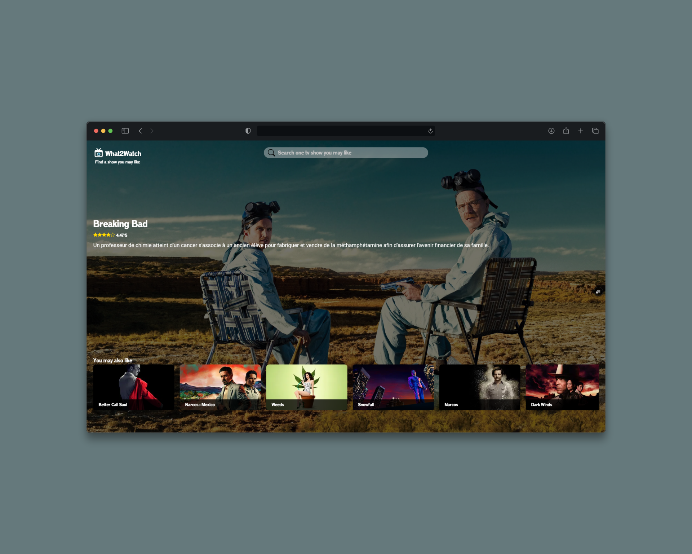

# React TvShow (Tuto)

> Une petite app React pour explorer des séries, leurs notes et découvrir des recommandations 👀

---

## 🚀 Le projet

Ce projet est une application web développée avec **React** qui permet de :

- 🔍 Rechercher des séries
- ⭐ Consulter leurs notes
- 🎯 Découvrir des recommandations liées à une série

👉 L'idée était surtout de créer une interface fluide et agréable pour naviguer entre différentes séries.

---

## 💡 Contexte

Je préfère être transparent 👇

Ce projet n’est **pas une idée 100% originale**.  
Je l’ai réalisé en suivant une **formation / tutoriel en ligne**, avec pour objectif de :

- Comprendre React en pratique
- Apprendre à structurer une app
- Manipuler des APIs
- Travailler le rendu dynamique des données

👉 J’ai ensuite repris le projet à ma sauce pour bien comprendre chaque partie.

---

## 🛠️ Tech utilisées

- ⚛️ React
- 🌐 API de séries (type TVMaze / TMDB)
- 🎨 CSS

---

## 📸 Aperçu de l'application

<p align="center">
  
</p>

---

## ⚙️ Installation

```bash
git clone https://github.com/RaphOnline/TutoReactTVShow.git
cd TutoReactTVShow
npm install
```
A la racine du projet créer un fichier .env avec à l'intérieur
```bash
REACT_APP_TMDB_KEY = VOTRE_CLE_TMDB
```
Puis 
```bash
npm run start
```